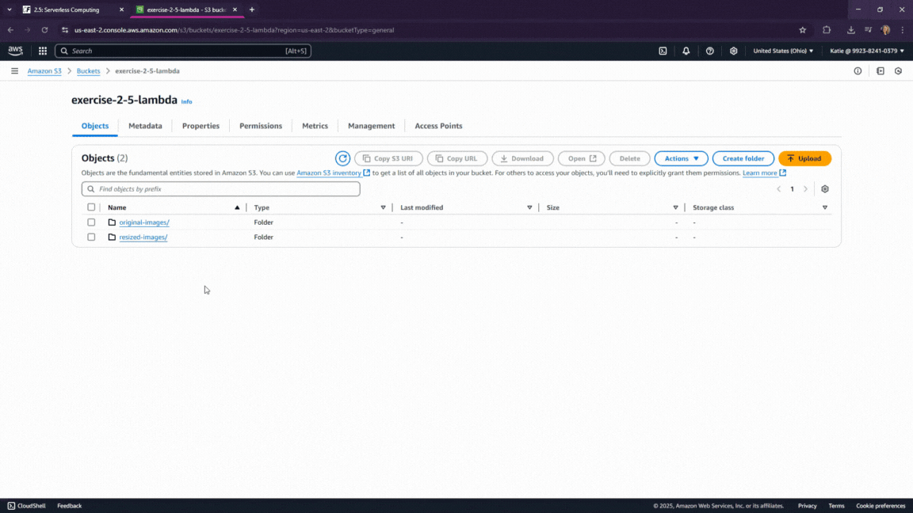

# Image Resizer (AWS Lambda)

This project contains an AWS Lambda function that automatically resizes image files uploaded to an S3 bucket. When a user uploads an image to the `original-images/` folder of the S3 bucket, this function is triggered to resize it and save the new version to the `resized-images/` folder.

## Features

- Triggered automatically by S3 object uploads
- Resizes images to a width of 300px (maintaining aspect ratio)
- Saves resized images in a separate S3 folder
- Built with <strong>Node.js</strong> and the <strong>Sharp</strong> library
- Uses the AWS SDK for file handling between S3 buckets

## Technologies Used

- **Node.js 22.x**
- **AWS Lambda**
- **AWS S3**
- **AWS SDK v3**
- **Sharp**

## How It Works

1. A user uploads an image to the `original-images/` folder in the designated S3 bucket.
2. This triggers the Lambda function via an S3 event.
3. The Lambda function:
   - Downloads the image
   - Resizes it to 300px wide (maintaining aspect ratio)
   - Uploads the resized image to the `resized-images/` folder in the same bucket

## Folder Structure

    📁 image-resizer/
    ├── index.js          # Lambda handler function
    ├── package.json      # Project dependencies
    ├── package-lock.json
    └── node_modules/     # Included in deployment zip, not in repo

## Usage

1. Zip the contents of this folder (excluding `node_modules` unless deploying manually).
2. Upload the ZIP to AWS Lambda.
3. Set up an S3 trigger for the Lambda function, filtering on the `original-images/` prefix.
4. Ensure the function's execution role includes permissions for `GetObject` and `PutObject` on the bucket.

## Screenshots

_Add your screen recording or .gif demo here once ready:_

## License

This project is licensed under the MIT License.
